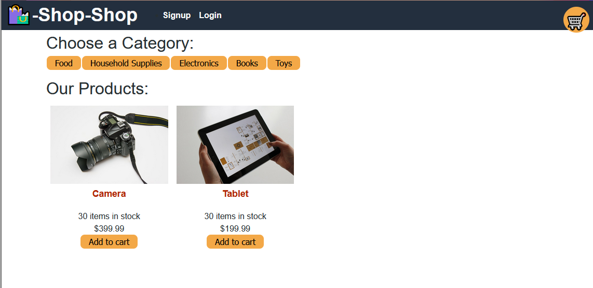
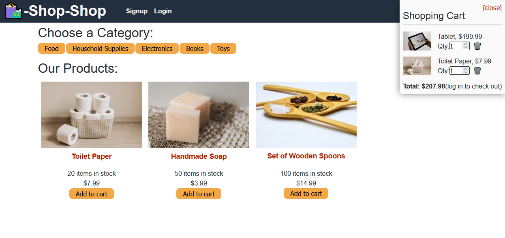

# Redux Store

An ecommerce solution built on React and Redux with a GraphQL backend.

## Description

This was an exercise in converting an eCommerce front end from using React's useContext and useReducer hooks to using Redux to manage the state. The app is a fully functioning eCommerce site with Stripe as the payment API: adding, removing, and updating a shopping cart are all available.

Note: all of the original react code is still in the app but commented out to show the difference between the two methods, and the better readability and maintainability of Redux.

## Installation

After forking the repo, run the following commands in the terminal:

    npm install
    npm run seed
    npm run develop

This will install all dependencies, seed the database with test data (note: it defaults to a local database), and run the app the locally.

To link to a MongoDB Atlas, add a .env file with your uri to your atlas instance as the environment variable ``MONGODB_URI``.

On the front end, update the Cart component with your Stripe credentials, or convert to your payment API of choice.

## Usage

The landing page will show you all the available products for purchase along with available categories:

Clicking on a category will filter the products to just that category:

When you view your cart, you can see all the items added and quantities, update quantities, and if you're logged in, be taken to stripe to checkout:

## Questions

Please send any questions to me through github (mdbow22) or by creating an issue on this repo.

## Demo

A live demo can be found here: https://vast-chamber-53227.herokuapp.com/

If you do not wish to create an account, you can use the below credentials:

    email: eholt@testmail.com
    password: password12345